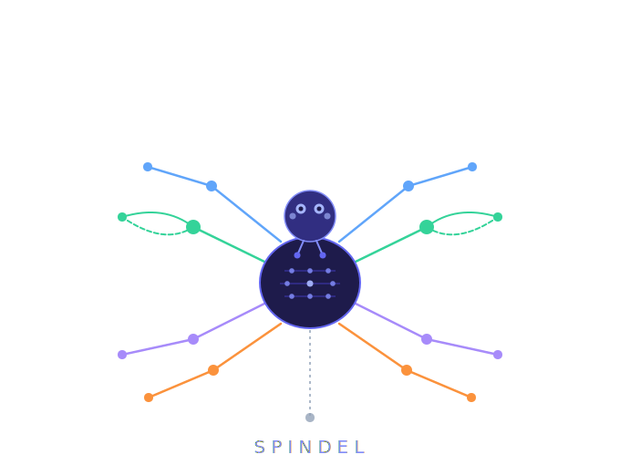

  

<h1 align="center">Spindel</h1>

  <em>Graph Genome Evaluation: Comparing Linear and Pangenome References for Structural Variant Detection</em>

  
  
  
  
  

---

## Overview

Does your reference genome affect structural variant detection?

This project benchmarks SV detection across three reference strategies:

| Strategy | Reference | Type |
|---|---|---|
| Linear | GRCh38 | Standard linear |
| Complete | T2T-CHM13 v2.0 | Telomere-to-telomere |
| Pangenome graph | HPRC v1.1 (Minigraph-Cactus) | Graph-based |

Evaluated on both **short-read** (Illumina WGS) and **long-read** (PacBio HiFi) data from clinical cohort.

---

## Progress

> **Status: actively in development** — results and scripts are updated as analysis completes.

*Supervisor:* **Jesper Eisfeldt**

*Subject reader:* **Adam Ameur**
